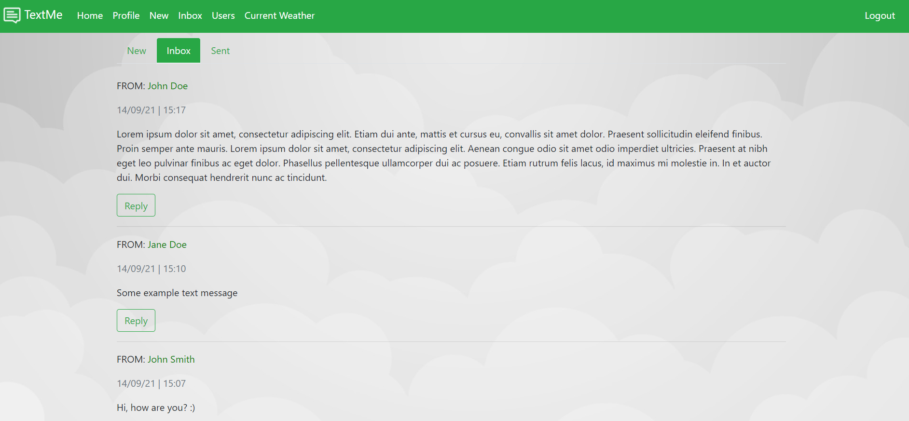

# TextMe
A simple message app where registered users can send private messages to each other.

## Demo
Here is a working live demo: https://smartninja-text-me.herokuapp.com/

## General info
This application was built as a final project for the SmartNinja Web Development 1 course. 

Aside from sending and receiving text messages, users can also check the current weather.

## Built with
* Flask - version 1.0.2
* Jinja2 - version 2.10.3
* Bootstrap - version 4.3.1
* OpenWeatherMap API 
